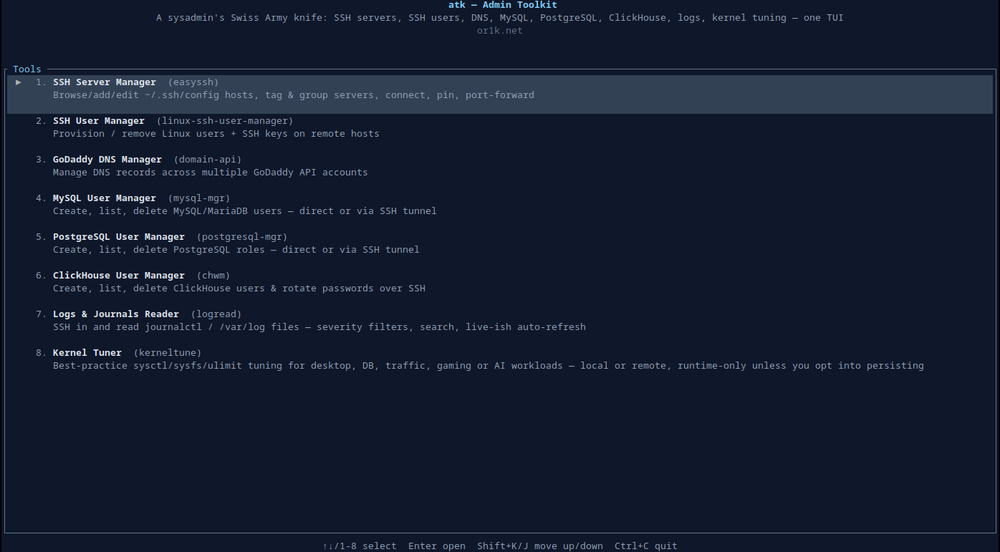

# atk — Admin Toolkit

By [or1k.net](https://or1k.net)



A single Rust + [ratatui](https://ratatui.rs) TUI binary that bundles eight
sysadmin tools:

| Module | What it does |
|---|---|
| **SSH Server Manager** | Browse/add/edit/delete hosts straight from `~/.ssh/config` (comments and untouched blocks preserved byte-for-byte), tag servers and browse them by tag like folders, connect with one keypress, pin favorites, ping, copy the resolved `ssh` command, background port forwarding |
| **SSH User Manager** | Create/remove Linux users + `authorized_keys` on remote hosts, manage reusable SSH key "profiles" |
| **GoDaddy DNS Manager** | Manage DNS records across multiple GoDaddy API accounts |
| **MySQL User Manager** | Create/list/delete MySQL/MariaDB users, rotate passwords, grant privileges — direct or via an SSH jump host |
| **PostgreSQL User Manager** | Create/list/delete PostgreSQL roles, rotate passwords, grant database privileges — direct or via an SSH jump host |
| **ClickHouse User Manager** | Create/list/edit/delete ClickHouse users (password, profile, allowed IPs) — direct SQL over HTTP (optionally via an SSH tunnel) or the legacy SSH + `users.d/*.xml` route |
| **Logs & Journals Reader** | SSH in and read the systemd journal (`journalctl`) or a plain file under `/var/log` (browsable), with severity filtering (warning/error/crit/...), text search, and optional auto-refresh |
| **Kernel Tuner** | Best-practice sysctl/sysfs/ulimit tuning (51 curated tunables, each with a plain-English why) for desktop, database, traffic, gaming, AI/compute or security-hardening workloads — local or remote over SSH, runtime-only unless you opt into persisting |

The MySQL, PostgreSQL and ClickHouse managers all save reusable **connection
profiles** (label, host, port, DB user, encrypted password, optional SSH
tunnel settings) so credentials are only entered once — pick a saved
connection from a dropdown instead of retyping it every time. ClickHouse
connections additionally pick a **mode**: direct `SQL` (ClickHouse's HTTP
interface) or legacy `SSH (XML)` (hand-edits `/etc/clickhouse-server/users.d/*.xml`
over SSH, for deployments that provision users that way).

Run `atk` with no arguments to get a home menu — pick a tool, use it,
`Esc` goes back to the menu, `Ctrl+C` quits from anywhere. The menu order
is customizable: `Shift+K`/`Shift+J` on a tool moves it up/down, saved immediately to
`menu_order.json` (e.g. move a DB manager into slot 1 if that's what you
reach for first).

## Build & run

```bash
cargo build --release
./target/release/atk
```

## Config

All eight modules share one config directory:

```text
Linux:   ~/.config/admintoolkit/
macOS:   ~/Library/Application Support/admintoolkit/
Windows: %AppData%/admintoolkit/
```

but each keeps its own file inside it, so the tools stay independent:

```text
admintoolkit/
├── easyssh.json        SSH Server Manager: tags/pin/last-seen/SSH-count metadata (servers themselves live in ~/.ssh/config)
├── menu_order.json     Home menu: your custom tool order, if you've moved anything with K/J
├── ssh_users.json     SSH User Manager: profiles + default SSH settings
├── clickhouse.json    ClickHouse Manager: connection profiles (mode, host/port/user or SSH target, encrypted passwords)
├── godaddy.json        GoDaddy Manager: accounts (label, API key, encrypted secret)
├── mysql.json          MySQL Manager: connection profiles (host/port/user, encrypted DB + SSH passwords)
├── postgresql.json     PostgreSQL Manager: same, for Postgres
├── logs.json            Logs & Journals Reader: connection profiles (host/SSH user/key, encrypted SSH password)
├── kerneltune_history.json  Kernel Tuner: per-target history of applied/persisted changes, for Revert
└── .godaddy.key         random AES-256 key used to encrypt every secret above at rest
```

Files are created automatically on first use. `.godaddy.key` is written with
`0600` permissions on Unix.

### About secret storage

There's no cross-platform equivalent of an OS-backed keychain (Keychain on
macOS, DPAPI on Windows, libsecret/kwallet on Linux) without pulling in a
native keyring dependency (which needs libsecret/dbus dev headers to build
on Linux), so `atk` instead encrypts every secret it stores — GoDaddy API
secrets, and MySQL/PostgreSQL/SSH passwords for the DB managers — with
AES-256-GCM under a random key stored next to the data
(`.godaddy.key`, owner-only permissions; the name predates it covering more
than GoDaddy). This protects secrets from casual disk/backup browsing, but
— unlike an OS keychain — the key lives on the same disk as the ciphertext,
so it isn't a defense against another process running as the same user.
Don't sync `~/.config/admintoolkit/` to a shared or less-trusted machine
without both files.

### SSH Server Manager: `~/.ssh/config` as the source of truth

Servers aren't stored in atk's own config at all — they *are* whatever
`Host` blocks are in `~/.ssh/config`, the same file `ssh` itself reads.
Editing a server through the TUI writes straight back to that file; blocks
you haven't touched (including comments and a global `Host *` block, say)
round-trip byte-for-byte, and every write goes through an atomic
temp-file-plus-rename plus two kinds of backup: a one-time
`config.original.backup` next to the file (created before atk's very first
edit, never overwritten again) and a rolling `config-<timestamp>-easyssh.backup`
on every subsequent save (newest 10 kept, older ones pruned automatically).

Tags/pin/last-seen/SSH-count aren't SSH concepts, so they live separately
in `easyssh.json` instead of being smuggled into the config file as
comments. Tags double as **groups**: the Tags tab (`F2`) lists every tag
with a count, and opening one filters the server list down to just that
tag — a lightweight "folder" view for grouping servers by role (`VPS`,
`DB`, ...) or environment without touching the underlying SSH config.

Only the dozen or so fields people actually set by hand (Host/User/Port,
identity files, `ProxyJump`, `LocalForward`, `ForwardAgent`, ...) get their
own form field; every other `ssh_config` directive (ciphers, `ProxyCommand`,
`ControlMaster`, canonicalization, ...) round-trips through a single
semicolon-separated **Advanced** field (`Key: Value; Key2: Value2`) instead
of a dedicated widget each — nothing is lost, it just isn't all
individually labeled.

### One host, entered once

Every screen with an SSH-related field (SSH User Manager's Servers list;
MySQL/PostgreSQL/ClickHouse's SSH tunnel host; Logs & Journals' target host)
can pull from hosts already saved in the SSH Server Manager instead of
retyping them: press `Enter` (or click) on the field and a filterable
picker lists every `Host` block from `~/.ssh/config`, prefilling
Host/Port/User/identity file from whichever one you pick. A block with no
explicit `HostName` (just `Host 10.0.0.5` on its own, say) resolves to the
alias itself as the target, the same way `ssh` treats it. In the SSH User
Manager, since Servers is a bulk comma-separated list, picking a host
*appends* it instead of replacing the field, so you can build up a
multi-server list by mixing picks and pasted IPs.

This only ever fills the SSH side — database-specific fields (DB user,
password, port) aren't part of an SSH host and are always left for you to
fill in, since a tunnel's jump host isn't the database itself.

Connection pickers that show a dropdown (MySQL/PostgreSQL/ClickHouse's
Users-tab "Connection" field, Logs & Journals' Connection field) match
against the underlying host too, not just the label you gave it — typing
an IP finds a connection named something else entirely, same as typing
its name would.

### Logs & Journals Reader

Its Connections tab lists every `~/.ssh/config` host directly, right
alongside anything you've explicitly saved as a profile (with password) —
no separate "add it first" step. Picking one of these fills the form so
you can view its logs immediately, or hit Save if you want it to stick
around as a real profile (e.g. to attach an SSH password). Saved profiles
and `~/.ssh/config` hosts share one scrollable, clickable list, so this
works the same however many hosts you have.

Then a Viewer tab that runs one of two read-only remote commands:

- **Journal** — `journalctl`, optionally scoped to a systemd unit
  (`nginx.service`) and/or a `--since` window (`1 hour ago`, `2024-01-01`),
  with server-side text search (`-g`) so the search actually reaches back
  further than whatever's in the last N lines.
- **File** — `tail -n <lines>` on any path (defaults to `/var/log/syslog`),
  with a **Browse** button that lists the remote `/var/log` tree (or
  wherever you point it) over SSH so you don't have to already know the
  exact filename.

Both modes share a **Priority** filter (`All` down through `Emerg`) —
`journalctl -p` for Journal mode; for File mode, since plain text files
have no structured severity, it's a best-effort keyword match (picking
`Warning` greps for `warn|error|crit|alert|emerg` and everything more
severe, same idea `journalctl -p` uses). **Auto-refresh** re-runs the same
query every 5s for a rough `tail -f` feel without holding a long-lived
streaming connection open.

### MySQL / PostgreSQL: direct connection vs. SSH tunnel

Each connection profile can either dial the database directly, or open an
SSH tunnel first (like `ssh -L`) and connect through that — useful when the
database only listens on a jump host's internal network. Toggle "Use SSH
Tunnel" in the connection form; the extra SSH Host/Port/User/Key/Password
fields appear once it's on. Either way, connect using a database user that
has user-management privileges — the connection form reminds you of this
(root / a MySQL admin user with `CREATE USER`/`GRANT`, or the `postgres`
superuser / a role with `CREATEROLE`).

### GoDaddy DNS Manager

Opening the Records tab auto-fetches every configured account's records
the first time (as long as at least one account is set up), and picking
an account or domain from the Fetch box's dropdowns re-fetches
automatically too — no separate "Fetch" click needed unless you want a
manual refresh. Press `y` on a selected record to copy its Value to the
clipboard (the IP an A record points at, say).

### Kernel Tuner

A curated catalog of 51 kernel tunables — sysctl keys, a handful of
sysfs-backed knobs (CPU governor, I/O scheduler, transparent hugepage), and
`/etc/security/limits.d` entries — each with a plain-English description,
the actual *why*, and per-scenario recommended values. Four tabs: **Target**
(local or a remote host over SSH), **Catalog** (filter by category or pick a
usage profile — Desktop, Traffic, Database, Gaming, AI/Compute, Security —
to bulk-stage its recommendations, still hand-editable afterward), **Review**
(the staged diff, Apply All/Clear All), **Revert** (history of everything
atk changed on that target, revert one entry or all of them).

Applying a value only ever runs `sysctl -w` (or the sysfs/limits
equivalent) at runtime — `/etc/sysctl.conf` and `/etc/security/limits.conf`
are never touched unless you explicitly opt into persisting, at which point
it drops a scoped `/etc/sysctl.d/99-atk-tuning.conf`, a small systemd
oneshot unit to replay sysfs values at boot, or the relevant `limits.d`
entry. Revert knows about that distinction too, and cleans up the
persisted entry along with the live value.

## CLI (scriptable, non-interactive)

The SSH User Manager also has a non-interactive CLI, useful for scripting
(the ClickHouse and GoDaddy modules are TUI-only):

```bash
atk ssh-user profiles list
atk ssh-user profiles add --name deploy --key "ssh-ed25519 AAAA... me@host"
atk ssh-user profiles delete --name deploy

atk ssh-user user add --server 10.0.0.5,10.0.0.6 --profile deploy
atk ssh-user user remove --server 10.0.0.5 --profile deploy

atk ssh-user settings show
atk ssh-user settings set --ssh-user root --ssh-key-path ~/.ssh/id_ed25519 --port 22
```

## Keybindings

Every screen follows the same pattern:

| Key | Action |
|---|---|
| `Tab` / `Shift+Tab` | Next / previous field |
| `↑` / `↓` | Also moves between fields (or table rows / dropdown options when focused on one) |
| `Enter` | Activate the focused button, or open a dropdown |
| `F1`..`F4` | Switch tab within a tool |
| `Esc` | Close a modal / dropdown, otherwise go back to the home menu |
| `Ctrl+C` | Quit immediately from anywhere |
| `Ctrl+Y` | Copy the History panel to the clipboard |
| `Ctrl+↑` / `Ctrl+↓` | Scroll the History panel |
| `F12` | Toggle mouse capture on/off (see Mouse support below) |

The SSH Server Manager's server list has its own richer keymap (`F1`
Servers / `F2` Tags, then on a row): `Enter` connect, `a` add, `e` edit,
`d` delete, `p` pin/unpin, `t` edit tags, `c` copy the `ssh` command,
`g` ping, `f`/`x` start/stop port forwarding, `r` refresh, `s`/`S` change
sort field/direction, `/` search.

## Mouse support

atk is keyboard-first: every action reachable by mouse is reachable the
same way by keyboard, so mouse capture is **off by default**. With it off,
the terminal handles clicks and drags itself, which means native text
selection and its usual copy shortcut (Ctrl+Shift+C, Cmd+C, right-click,
...) just work, untouched by the app.

`F12` turns capture on for anyone who wants it. Once on, every screen's
tab bar, tables, buttons, and input fields are clickable — click a tab to
switch to it, click a table row to select and open/load it (the same
thing `Enter` does), click a field to focus it, click a button to
activate it, and scroll the wheel over a table/list — including the
History log panel every screen has — to move the selection or scroll the
text. GoDaddy's Add/Edit DNS Record dialog has full click support too
(fields, the type toggle, the pending list, Save/Cancel). A few dense
modal forms (the SSH Server Manager's full Add/Edit Server dialog, the
MySQL/PostgreSQL/ClickHouse Add/Edit User dialogs) are keyboard-only even
with capture on, since their forms are dense enough that Tab navigation is
still the fastest way through them.

Capture only requests click and scroll reporting, not continuous motion
tracking — some terminals otherwise flood the input stream with a mouse
event per pixel of movement, which queues up ahead of keystrokes and
makes keyboard input feel broken under mixed mouse+keyboard use.

## Why one binary

Eight sysadmin tools, one static Rust binary, one shared config directory —
easier to ship to a server or a teammate than juggling separate toolchains,
install paths, and configs, with consistent keybindings/theme across every
tool.

---

Made by [or1k.net](https://or1k.net).
